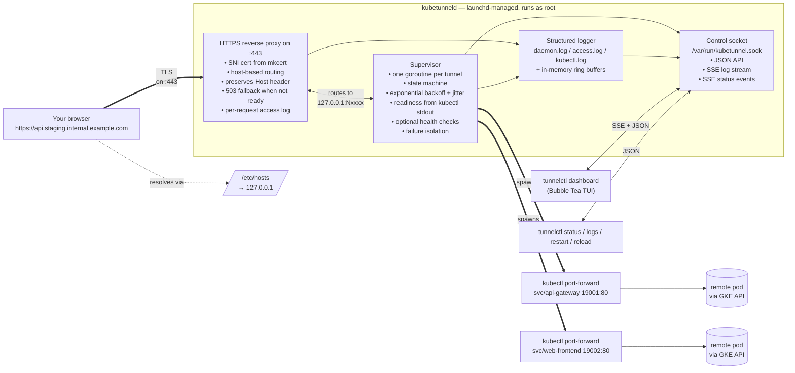
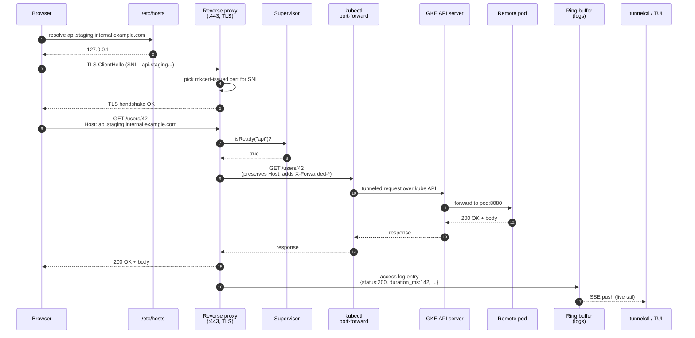

# kubetunnel

A resilient `kubectl port-forward` supervisor with a local HTTPS reverse proxy. It lets you open the **real** staging/internal URL of a remote Kubernetes service directly in your browser — no `localhost:9000` fakery, no IAP login walls, no scripts taped to your shell — while a background daemon keeps the underlying tunnels alive, restarts them when they drop, and gives you a live TUI + structured logs of everything that happens.

macOS only, for now.

## The problem it solves

When you need to access an internal Kubernetes service from outside the cluster, the options usually look like this:

1. **The public URL** (`https://service.staging.internal.example.com`) — but it's fronted by Cloud Armor / IAP / geo-blocks, and from the wrong country or without the right SSO session you get a 403 or a redirect to a login page that never ends.
2. **`kubectl port-forward`** — works, but gives you `http://localhost:9001` instead of the real URL. That:
   - breaks any code that routes or signs URLs by Host header,
   - breaks TLS (no cert for `localhost`),
   - silently dies after a few minutes (auth expiry, pod reschedule, network blip),
   - forces you to babysit a terminal per service.
3. **VPN + /etc/hosts hacks** — fragile, machine-wide, conflicts with corporate VPN.

kubetunnel is option 2 turned into a proper background service, with the missing pieces filled in:

- A **reverse proxy** listens on `127.0.0.1:443` and fronts every port-forward, so you can open `https://service.staging.internal.example.com` in the browser and get the real thing.
- A **local CA** (via [`mkcert`](https://github.com/FiloSottile/mkcert)) issues per-hostname certs trusted by the system keychain, so there are no TLS warnings.
- `/etc/hosts` is rewritten (under a delimited block so it stays idempotent) to point each hostname at `127.0.0.1`.
- A **supervisor** runs one `kubectl port-forward` per tunnel, parses stdout for the readiness line, restarts with exponential backoff, and isolates failures so one dead tunnel never kills the rest.
- Everything is **launchd-managed**, so it survives reboots and crashes.
- A **TUI dashboard** and a `tunnelctl logs` CLI give you a live view with searchable, filterable, structured logs.

The end result: you forget the thing is there until you need to look at it.

## How it works



### Request walkthrough



1. **Name resolution** — the browser asks the OS for the hostname; `/etc/hosts` hijacks it to `127.0.0.1`.
2. **TLS handshake** — the proxy picks the right cert per SNI from the mkcert store, so the browser trusts it with no warning.
3. **Routing** — the proxy looks up the backend by `Host` header. If the tunnel's supervisor state is not `Running` it short-circuits with a friendly `503 + Retry-After`.
4. **Forwarding** — request goes to `127.0.0.1:19001` where `kubectl port-forward` is listening. The proxy keeps the original `Host` and injects `X-Forwarded-Proto: https` and `X-Forwarded-Host` so the pod sees what it would see through Istio.
5. **Tunnel** — `kubectl` pipes the TCP through the GKE API server (authenticated with your kubeconfig) to the target pod's port.
6. **Response** — flows back the same way.
7. **Observability** — the proxy wraps the `ResponseWriter` to record status + bytes + duration, and the supervisor emits lifecycle events. Both land in a per-tunnel in-memory ring buffer that the TUI and `tunnelctl logs -f` subscribe to over SSE. Nothing polls the disk.

### What happens when things break

| Failure | What kubetunnel does |
|---|---|
| `kubectl` exits (auth expired, pod rescheduled, network blip) | Supervisor catches the exit, logs it, enters **Backoff** for 1→60s (exponential with jitter), then re-spawns. |
| Health-check fails N times in a row (configurable) | Supervisor kills the `kubectl` child and re-spawns from scratch. |
| `kubectl` keeps crashing (>10 restarts / 60s) | Tunnel enters **Failing**, pauses for 5 min, then retries. Other tunnels keep running. |
| A request arrives while a tunnel is reconnecting | Proxy returns a friendly HTML `503 Service Unavailable` with a `Retry-After`. Browser auto-retries and it just works a second later. |
| The daemon itself crashes | launchd relaunches it within ~10 s (throttled). On next start, it re-reads the config, re-issues certs if needed, and resumes. |
| Config changes | `tunnelctl reload` (or `SIGHUP`) — the supervisor diffs tunnels and starts/stops/keeps each one without dropping unrelated connections. |

The guiding principle: **the daemon never dies because of a bad tunnel**. Every runner has its own goroutine with a `recover()`, every error is logged and bucketed to the offending tunnel, and the proxy keeps serving `503` for dead backends while the healthy ones remain untouched.

## Install

```bash
git clone https://github.com/yourhandle/kubetunnel.git ~/kubetunnel
cd ~/kubetunnel
./scripts/install.sh
```

The script:
1. Verifies `go`, `mkcert`, and `kubectl` are on `PATH`.
2. Builds `kubetunneld` + `tunnelctl` and installs them under `/usr/local/bin` (one `sudo`).
3. Copies `config.example.yaml` → `~/.config/kubetunnel/config.yaml` if you don't have one yet.
4. Runs `mkcert -install` to add its root CA to your system keychain, then issues a cert for every hostname in the config.
5. Writes the delimited `/etc/hosts` block and installs the LaunchDaemon at `/Library/LaunchDaemons/dev.kubetunnel.plist`.

From there, `kubetunneld` runs in the background as root, relaunches itself after crashes, and starts automatically at boot.

**Optional — skip password prompts on every update**:
```bash
./scripts/install-sudoers.sh
```
This writes a `visudo`-validated snippet at `/etc/sudoers.d/kubetunnel-dev` that whitelists exactly the three commands `scripts/update.sh` needs (binary installs + `launchctl kickstart` for `system/dev.kubetunnel`). After that, `./scripts/update.sh` runs end-to-end without ever asking for a password.

## Commands

```bash
tunnelctl status                                     # table of tunnel states
tunnelctl dashboard                                  # TUI with live logs
tunnelctl logs --tail 200                            # last 200 entries
tunnelctl logs -f                                    # live tail (SSE)
tunnelctl logs --filter "level:error AND tunnel:api"
tunnelctl logs --filter "status:5xx"                 # via proxy access log
tunnelctl logs --filter "duration_ms:>500"
tunnelctl restart --name api                         # force restart one tunnel
tunnelctl reload                                     # hot-reload config
tunnelctl debug --name api                           # dump config + recent entries
tunnelctl shutdown                                   # launchd will relaunch
sudo tunnelctl uninstall                             # remove hosts entries + plist
```

## TUI keybindings

| Key | Action |
|---|---|
| `↑`/`↓` or `j`/`k` | Navigate tunnels |
| `tab` | Switch focus between table and logs pane |
| `r` | Restart selected tunnel |
| `R` | Reload config |
| `/` | Incremental search in logs (with highlight) |
| `f` | DSL filter (see below) |
| `p` | Pause log stream |
| `F` | Toggle follow mode |
| `c` | Clear log pane |
| `esc` | Clear search |
| `q` / `ctrl+c` | Quit |

## Filter DSL

Used by both `tunnelctl logs --filter` and the TUI `f` prompt.

```
level:error                    # equality
tunnel:web                     # substring on tunnel name
status:5xx                     # status in 500..599
status:>=400                   # numeric comparison (<, <=, >, >=, ==)
duration_ms:>500               # slow requests (from access log)
path:/api/health               # substring on path
event:restart                  # exact event match
level:error AND tunnel:api     # AND (also implicit — two terms separated by a space)
level:error OR level:warn      # OR
NOT level:info                 # negation
(level:error AND tunnel:api) OR status:5xx   # grouping
"timeout"                      # quoted text search against msg/raw line
```

## Config

See [`config.example.yaml`](./config.example.yaml). Paths support `~` expansion.

Each tunnel needs at minimum `name`, `hostname`, `kube_context`, `namespace`, `target`, and `local_port`. Optional fields:

- `health_check` — `path`, `interval`, `timeout`, `fail_threshold`. Leave it out entirely if the target has no cheap health endpoint; the supervisor will still detect kubectl crashes without it.
- `headers` — extra headers to inject into every request going through the proxy for that tunnel.
- `environment.path_additions` / `environment.extra` — globally prepended to `PATH` and merged into the env of every `kubectl` subprocess. Important when the daemon runs under launchd with a minimal `PATH` and cannot find auth plugins like `gke-gcloud-auth-plugin` under `/usr/local/share/google-cloud-sdk/bin`.

## Log locations

All logs are JSON lines, rotated by [`lumberjack`](https://github.com/natefinch/lumberjack):

- `~/Library/Logs/kubetunnel/daemon.log` — supervisor lifecycle events (`starting`, `ready`, `backoff`, `health_check_failed`, …).
- `~/Library/Logs/kubetunnel/access.log` — one structured entry per HTTPS request the proxy handles (method, host, path, status, duration, bytes, user-agent).
- `~/Library/Logs/kubetunnel/kubectl.log` — raw stdout/stderr of every `kubectl port-forward` subprocess, prefixed by tunnel name.
- `~/Library/Logs/kubetunnel/daemon.out.log` / `daemon.err.log` — launchd's own capture of the process (fallback in case the daemon dies before its logger is up).

Live tailing via `tunnelctl logs -f` does **not** poll files — it subscribes to an in-memory ring buffer over the control socket (SSE), so there's effectively no lag and no extra disk I/O.

## Troubleshooting

- **`daemon unreachable: dial unix /var/run/kubetunnel.sock: no such file`** — launchd isn't running the daemon. Check with `sudo launchctl print system/dev.kubetunnel`; force-start with `sudo launchctl kickstart -k system/dev.kubetunnel`; inspect `~/Library/Logs/kubetunnel/daemon.err.log`.
- **`no certificate available (SNI=...)`** — mkcert didn't issue a cert for that hostname. Re-run `tunnelctl cert-install`.
- **`kubectl exited: exit status 1` + `executable gke-gcloud-auth-plugin not found`** — the launchd `PATH` doesn't see your gcloud SDK install. Add the SDK's `bin` directory under `environment.path_additions` in your config and `tunnelctl reload`.
- **`kubectl exited: exit status 1` + `You must be logged in to the server`** — auth tokens expired. Run `gcloud auth login` (or `aws eks update-kubeconfig`, etc.) and let the supervisor's backoff retry pick it up.
- **`:443 bind: permission denied`** — the daemon has to run as root to listen on a privileged port. That's what the LaunchDaemon plist is for; a `LaunchAgent` (per-user) won't work on `:443`.
- **Browser shows "Not secure" warning** — mkcert's CA isn't trusted yet. Run `mkcert -install` once.
- **Request lands on the wrong tunnel** — two tunnels share a hostname. `tunnelctl status` will show both; config validation refuses duplicates on next `reload`.

## License

Personal tooling. No license granted. Use at your own risk.
